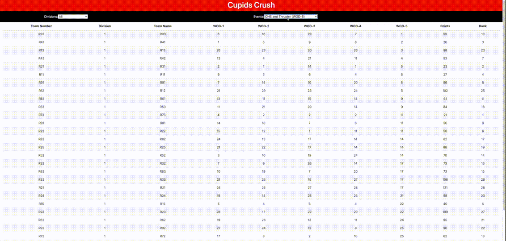

# Cupids Crush #

  ## **Table of Contents**
  * [Contributors](#contributors)
  * [Description](#description)
  * [Technology](#technology)
  * [Questions](#questions)

      
  ## **Live Link**
  https://glacial-falls-13622.herokuapp.com/      
  ## **Description**
  Cupids Crush is a website built using React.js to display current team or individual standings for a competition. It is being built to be used for local events, though it can be easily used anywhere with a few adjustments. The website makes API calls to receive the current standings from the database being used in the competition. It is still in development, especially the UI portion. There is currently no deployed version of the application.

  ## **Demo**
  #### **Desktop/Laptop**
  

      
   ## **Contributors**
  * [Robert Anderson](https://github.com/reanderson89)

  (Though Brian's work is not shown here, he is the creator of the API that this application reaches out to for the data)
  * [Brian Owen](https://github.com/mistofthenorth)
      
  

  
  ## **Technology**
    Javascript, React.js, Axios
  

  ## **Questions**   
  ####    **For any questions or inquiries please contact me at,**

**Robert Anderson**
  * #### **GitHub:** [@reanderson89](https://github.com/reanderson89)
  * #### **Email:** [reanderson89@gmail.com](reanderson89@gmail.com)

  
      
